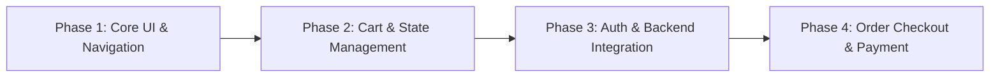

# Restaurant App — Project Progress & Status Report

**Date:** September 8, 2026  
**Project:** Restaurant App (`restaurant-app`)  
**Repository Branch:** `main`  
**Status Overview:** Phase 1 (Core UI & Frontend Foundation) — **Complete & Production Build Passing**

---

## 🚀 1. Executive Summary

The **Restaurant App** is a modern, responsive, high-performance web application built with **React 19**, **TypeScript**, **Vite**, **Tailwind CSS v4**, **DaisyUI**, and **Redux Toolkit**. 

The core user interfaces—including the landing page, dynamic food menu with category filtering, theme toggle (light/dark), dynamic sticky navigation bar, mobile-responsive navigation drawer, and animated authentication modals (Login and Register)—are fully implemented and visually polished.

The project currently compiles cleanly with zero TypeScript errors and generates an optimized production bundle (`vite build` in 2.63s).

---

## 🛠️ 2. Technology Stack Overview

| Category | Technology | Usage / Details |
| :--- | :--- | :--- |
| **Frontend Framework** | React 19 (`react` 19.2.8) | Modern component architecture, hooks (`useState`, `useEffect`, `useCallback`, `useRef`) |
| **Language** | TypeScript (~6.0.2) | Strict type checking across components, models, and data types |
| **Build Tooling** | Vite (`vite` 8.2.2) | Lightning-fast HMR and optimized production bundle |
| **Styling & Design System** | Tailwind CSS v4 + DaisyUI v5 | Custom glassmorphism, responsive grid system, keyframe animations |
| **State Management** | Redux Toolkit (`@reduxjs/toolkit` 2.12.0) | Global state for UI themes (`themeSlice`), typed hooks (`useAppSelector`, `useAppDispatch`) |
| **Routing** | React Router v7 (`react-router-dom` 7.18.3) | Client-side page navigation (`/`, `/menu`, `*`) |
| **HTTP Client** | Axios (`axios` 1.20.0) | Installed for future REST API integration |
| **Icons** | Lucide React (`lucide-react` 1.42.0) + Inline SVGs | Clean scalable graphics |

---

## 📁 3. Architecture & Directory Breakdown

```
restaurant-app/
├── public/
├── src/
│   ├── assets/               # Static images & graphics
│   ├── components/           # Reusable UI elements
│   │   ├── common/           # Generic UI components (Buttons, Modals, Headings, Tabs)
│   │   │   ├── Button.tsx
│   │   │   ├── FilterTabs.tsx
│   │   │   ├── LoginModal.tsx
│   │   │   ├── RegisterModal.tsx
│   │   │   ├── SectionHeading.tsx
│   │   │   └── NotFound.tsx
│   │   └── layout/           # Shared layout wrappers
│   │       ├── Container.tsx
│   │       ├── Footer.tsx
│   │       ├── FooterIllustration.tsx
│   │       ├── Navbar.tsx
│   │       └── ThemeToggle.tsx
│   ├── features/             # Feature-based domain modules
│   │   ├── common/
│   │   │   └── pages/NotFoundPage.tsx
│   │   ├── home/             # Homepage feature module
│   │   │   ├── components/ (Hero, Categories, CategoryCard, PopularDishes)
│   │   │   ├── pages/HomePage.tsx
│   │   │   ├── data.tsx
│   │   │   └── types.ts
│   │   └── menu/             # Menu feature module
│   │       ├── components/MenuCard.tsx
│   │       ├── pages/MenuPage.tsx
│   │       ├── data.ts
│   │       ├── types.ts
│   │       ├── hooks/ (Prepared for custom hooks)
│   │       ├── services/ (Prepared for API integration)
│   │       └── store/ (Prepared for feature slice)
│   ├── layouts/
│   │   └── MainLayout.tsx    # App wrapper incorporating Navbar, Main, and Footer
│   ├── routes/
│   │   └── AppRoutes.tsx     # Route definitions
│   ├── store/                # Global Redux store
│   │   ├── slices/themeSlice.ts
│   │   ├── hooks.ts
│   │   └── index.ts
│   ├── App.tsx
│   ├── index.css
│   └── main.tsx
└── package.json
```

---

## 📊 4. Feature Implementation Matrix

### ✅ Completed Features
1. **Homepage Experience (`/`)**:
   - **Hero Section**: High-impact banner with CTA buttons ("Order Now", "Explore Menu").
   - **Category Showcase**: Interactive food category cards (Pizza, Burgers, Pasta, Desserts).
   - **Popular Dishes Section**: Highlighted items with images, pricing, and tags.
2. **Menu Page (`/menu`)**:
   - Dynamic food item filtering by category tabs ("All", "Pizza", "Burger", "Pasta", "Dessert").
   - Responsive card grid displaying dish images, titles, descriptions, prices, and availability badges.
   - User-friendly empty state handling.
3. **Authentication UI**:
   - **Login Modal**: Modern glassmorphism card, show/hide password toggle, social auth buttons (Google, Facebook, Apple), Escape key press handler, backdrop lock.
   - **Register Modal**: Full signup form with password confirmation, seamless modal switching between Login & Register.
4. **Navigation & Global Layout**:
   - **Dynamic Navbar**: Responsive sticky bar that gracefully handles container scroll bounds, includes mobile hamburger menu and modal triggers.
   - **Footer**: Integrated custom footer with SVG wave illustrations and quick links.
   - **404 Page**: Custom fallback page for invalid routes.
5. **Theme Management**:
   - Redux-backed dark/light theme switching with instant DOM updating (`data-theme`).

---

### ⏳ Pending & In-Progress Features
1. **Authentication Backend Integration**:
   - Currently, form submissions log data to the console (`LoginModal.tsx` & `RegisterModal.tsx`).
   - *Next Step*: Implement an `authSlice` in Redux and wire up authentication REST endpoints with Axios.
2. **Shopping Cart & Checkout Flow**:
   - *Next Step*: Create `cartSlice` to track added items, quantities, subtotal calculations, and a cart sidebar drawer UI.
3. **Dish Search & Detail Views**:
   - *Next Step*: Add search input bar and dish detailed modal views (customizations, spice levels, add-ons).
4. **Backend API Connectivity**:
   - Currently utilizing static mock data (`src/features/menu/data.ts`).
   - *Next Step*: Populate `src/features/menu/services` with Axios requests for live menu fetching.

---

## 🩺 5. Code Quality & Build Verification Status

- **TypeScript Typecheck (`npx tsc --noEmit`)**:  
  🟢 **PASSED** (0 compilation errors)
- **Vite Production Build (`npm run build`)**:  
  🟢 **PASSED** (Built in ~2.63s)
  - `dist/index.html` (0.79 kB)
  - `dist/assets/index-CsaIpSO9.css` (81.68 kB)
  - `dist/assets/index-CYBMspbH.js` (311.23 kB)

---

## 🎯 6. Recommended Next Steps Roadmap



1. **Sprint 1: Cart System**
   - Implement `cartSlice.ts` in Redux Store.
   - Add "Add to Cart" functionality on `MenuCard` and `PopularDishes`.
   - Create a Slide-over Cart Drawer component.

2. **Sprint 2: Authentication & User State**
   - Implement `authSlice.ts` to persist user login state and JWT tokens.
   - Connect `LoginModal` and `RegisterModal` submit handlers to mock/real backend APIs.

3. **Sprint 3: Search & Filters**
   - Add real-time text search and price sorting on the `/menu` page.

---
*Report generated automatically for `restaurant-app` repository.*
